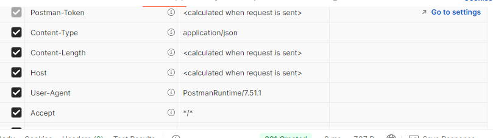
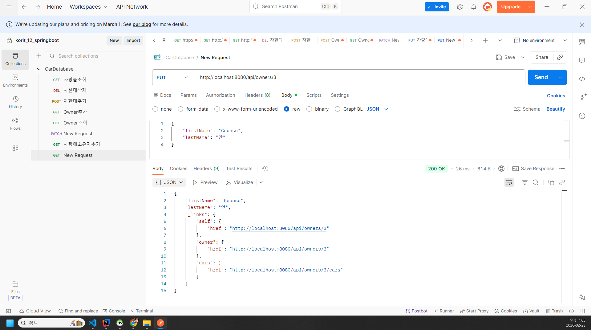

# 입실 체크 해주세요 !! 🎈

# 과제
- cardatabase00 으로 springboot 프로젝트를 생성하시오.
- dependencies injection은 start.spring.io를 사용하셔도 되고, 추후 mvn을 통해서 추가하셔도 무방합니다.
    1. devtools
    2. web
    3. mariadb - testdb
    4. jpa
    5. entity classes - Owner / Car
    6. Lombok은 적용하지 않고, 기존 cardatabase와 동일한 기능을 하도록 작성하시오.
    7. start.spring.io에서 generate 클릭하면 download 폴더에 들어갑니다. 걔를 korit_12_springboot로 이동시켜서 나중에 push할 수 있게끔 명확하게 세팅할 것.

git add .
git commit -m "feat: 20260223 springboot entity class review"
git push


// 12시~


# property
- maria db로 옮기고 난 후의 과정
- h2의 과정을 삭제하거나 주석처리해야함
- url 수정
- 데이터베이스 드라이버클래스 정의
- spring.jpa.generate-ddl 설정은 jpa가 데이터베이스를 초기화해야하는지 아닌지 정의
- spring.jpa.hibernate.ddl-auto 설정은 데이터베이스 초기화 작동방식을 정의
* none : db의 기본값 
* update  : 새로 켤떄마다 확안해서 차이점이 있는 경우에만 테이블관련설정을 업데이트함
* create : 생성만 하고 삭제안하므로 db의 값에 한번 들어가면 유지된다. 
* create_drop : h2에서 기본값임. 실행할떄마다 테이블을 새로 생성하고 종료되면 삭제.

```java
spring.application.name=cardatabase
spring.datasource.url=jdbc:mariadb://localhost:3310/cardb
spring.datasource.username=root
spring.datasource.password=1234
spring.datasource.driver-class-name=org.mariadb.jdbc.Driver
spring.jpa.generate-ddl=true
spring.jpa.hibernate.ddl-auto=create-drop
spring.jpa.show-sql=true
```

# Restful 웹 서비스
http 프로토콜을 이용하여 인터넷을 통해 통신하는 애플리케이션
웹 서비스아키텍처에는 다양한 유형들이있지만 restful api 가 사용되고있다.


1. spring data rest 사용법
2. 코드로 다 작성하려면 어떻게하는지

## REST 기초

relational state transfer  축약어
웹 서비스를 제작하기위한 아키텍처 스타일 . rest 특정언어나 플랫폼에 의존적이지 않으면서 모바일 웹, 기타 서비스 같은 다양한 클라이언트들이 서로 통신할수있음.
수요 및 기능 추가에 대해 확장성이높다...

- 하지만 restful 이 특정한 표준이나 프레임워크는 아니고 로이필딩? 이란개발자가 제시한 제약 조건들의
집합에 해당.

1. 상태 비저장: 서버는 클라이언트 상태에대한 어떤 정보도 저장하지않아야함

2. 클라이언트 서버간 독립성 : 클라이언트와 서버는 독립적으로 작동해야함. 그리고 서버는 클라이언트의 요청
없이는 어떠한 정보도 전송해서는 안댐.

3. 캐시 기능: 여러 클라이언트가 동일한 리소스를 요청하는 경우가 많아 성능 향상을 위해 리소스에 캐싱을 적용해야한다.

4. 일관된 인터페이스: 서로 다른 클라이언트에 의한 요청이라도 응답은 동일하게 보여야한다. 
클라이언트의 예시로는 브라우저 자바애플리케이션 등등등,..

5. 계층형 시스템: 전체 서비스에 영향을 주지않고 구성 요소를 추가하거나 수정할수있어야함.

6. 주문형 코드: 선택적인 제약 조건에해당한다 정적컨텐츠를 대부분의서버는 사용하는데 json또는 xml형식을 전송하는데 필요한경우 전송해야함.


특히 일관된 인터페이스는 중요한 제약 조건에 해당하기 때문에 rest아키텍처에 이하의 요소가 들어갈것을 요구한다.......

- 리소스 식별 :  리소스는 고유 식별자 (예: 웹 기반 rest서비스의 uri )로 식별해야한다. (앤드포인트개념)
rest리소스는 이해하기 쉬운 디렉토리 구조의 uri를 노출해야함

- 표현을 통한 리소스 조작: 리소스를 요청할떄 서버는 리소스의 표현으로 응답해야한다. 일반적인 표현형식으로 json/xml이있다.

- 자체 설명적인 메시지: 메시지는 서버가 처리방법을 알 수 있는 충분한 정보가포함되야한다.

- HATEOAS : Hypermedia As The Engine Of Application State의 약자 
응답에는 서비스의 다른 영역으로 표시되는 링크가 있어야한다. -> json내부에서 다른 링크 url이 있어서 서로 연결된다.

## Restful 웹 서비스만들기

- springboot 상에서 모든 http요청은 controller클래스로 처리된다....

- domain패키지와 동일한  controller패키지 생성
- controller패키지 내부에 CarController생성


```java

package korit_12.cardatabase00.controller;


import org.springframework.web.bind.annotation.RestController;

@RestController
public class CarController {
    @GetMapping("/cars")
    public List<car> getCars(){
        // 자동차를 검색하고 리턴하는로직
    }

}

```

- @GetMapping("/cars") : 는 localhost:8080/cars uri로 들어갔을 경우 getCars()라는 메서드가 호출될 수 있도록 경로를 설정한 것이라고 볼 수 있습니다. 특히 이상의 코드에서 모든 자동차 객체가 List 형태로 return 되는 것을 알 수 있는데, @RestController와 @GetMapping으로 인해 Java List로 리턴된 것이 자동으로 JSON 객체로 변환됩니다. 이상의 코드는 GET 요청만 처리할 수 있도록 되어있습니다. 그렇다면 @PostMapping, @DeleteMapping, @PutMapping 등도 있겠네요.

- 그렇다면 저희는 Car 객체들을 가지고 와야 한다는건데, 어디서 가지고 오나요. : DB에서 -> SpringBoot에서 DB에 접근하는 애는 누구다 ? -> Repository

- 그래서 이하의 코드를 확인했을 때, CarRepository를 자료형으로하는 field인 carRepository를 정의했고, 걔의 .findAll() 메서드를 호출하여 결과값을 가지고 왔습니다. -> .findAll() 정의한 적 없는데요? -> extends 받았으니까요.


```JAVA
package com.korit12.cardatabase.controller;

import com.korit12.cardatabase.domain.Car;
import com.korit12.cardatabase.domain.CarRepository;
import lombok.RequiredArgsConstructor;
import org.springframework.web.bind.annotation.GetMapping;
import org.springframework.web.bind.annotation.RestController;

import java.util.List;

@RestController
@RequiredArgsConstructor
public class CarController {
    private final CarRepository carRepository;

    @GetMapping("/cars")
    public List<Car> getCars() {
        return carRepository.findAll();
    }
}


## spring data rest 사용해보기 
- spring data rest는 스프링 데이터 프로젝트의 일부이며 스프링으로 restful 웹 서비스를 빠르게구현해주는 방식 
hateoas 도 지원한다.
build.gradle에 의존성 추가했습니다.
```JAVA
	implementation 'org.springframework.boot:spring-boot-starter-data-rest'
```
application.properties에 basePath 설정했습니다.

```JAVA
spring.data.rest.basePath=/api
```
근데 브라우저에서 해당 uri로 들어갔을 때 GET 요청이 이루어진건데, 컨디션 안좋으면 whitelabel이 뜹니다.

그래서 저희는 이 부분의 안정성을 위해 외부 프로그램을 도입하겠습니다. chrome에서 postman 검색해서 설치 -> GET 요청으로 localhost:8080/api/cars를 날렸을 때 자동차 목록이 JSON 형태로 나오면 성공입니다.


--- postman검색

- 설치 -> get요청으로 localhost:8080/api/cars를 날렷을때 자동차목록이 json형태로나오면성공

*Spring Data REST 장점*
1. Carcontroller 를 날렷는데 getCar() 메서드를 요청한 것과 동일한 값이나옴

2. getCars()만 있고 getCar(int id)가 없다. 하지만 자동차하나를 return하는 메서드가 알아서정의되었다.

3. Owner쪽은 건들지않았지만 getOwners와 getOwner가 다 존재한다. 즉 , Controller에 해당하는 클래스부분을 전부 다 의존성으로 처리햇다.

디폴트정보만가지고잇어서 커스텀이 불가하긴함 


## CRUD를 postman에서 실행
- 스프링데이터는 rest모든 작업을 제공한다.

http 메서드 | CRUD

------------|-----
GET|읽기(read)
POST|생성(create)
PUT/PATCH업데이트(update)
DELETE|삭제 (delete)

1. 삭제: DELETE 요청을 날려야하지만 전부다 삭제하고싶은게아니라면 특정 차를 삭제해야함

- localhost:8080/api/cars/1 URL로 DELETE요청을 날려야함

- 삭제의 경우 전체 삭제가아니라면 CALL3유형의 메서드를 가지게된다.매개변수 있고 RETURN없다. 


2. 생성 : POST 요청. POST요청을 한 시점에는 DB에 차가 있을까 없을까......?
DB에서 ID값을 가져오기때문에 POST요청을 하는 시점에는 당연히 고유값역할을 하는 ID가 없다. 
그러면 생성이후에 ID가 할당이된다.

- http://localhost:8080/api/vehicles


- CREATE 상황에서 중요한 점은 Content-Type : application/ json이어야한다. json형식으로 요청을 보냇으니....
- Q. 여러분 이름으로 owner 하나를 POST 요청하시오.

3. 수정 : PUT/PATCH업데이트(update) PUT을 사용하는 경우에는 전체 키,벨류 를 다입력해야하고 PATCH를 쓰는경우 수정할 부분의키,벨류만입력

```JSON
{
    "COLOR" : "검정"
}


```

-  근데 tesla차 만드는것은 좋지만 owner부분이 null로 입력되어있다. 방금 생성한것에 owner추가 
put 메서드추가

- url: http://localhost:8080/api/vehicles/5/owner
- text : Content-Type : text/url-list
- content: http://localhost:8080/api/owners/4

그런데 DB 상에서의 ID 값을 사용자들은 알 수가 없습니다. 자기 차량 정보를 수정하기 위해서는 기본적으로 id 값이 있어야 할 것 같은데 사용자들이 알지 못한다면 문제가 있을 수 있겠네요.

Brand 명 등을 통해서 검색을 해서 특정 자동차 정보를 가지고 올 수 있어야겠네요.

그리고 postman에서 GET http://localhost:8080/api/vehicles 를 검색했을 때, 맨 마지막에 http://localhost:8080/api/vehicles/search가 추가된 것을 확인할 수 있습니다.

즉 인터페이스에 커스텀 추상 메서드를 추가했고, 이것을 postman이나 백엔드 api에서 적용하기 위한 방법을 학습한 것이라고 할 수 있겠습니다.


## 과정
1. Repository클래스에  "@RepositoryRestResource"추가한다 .  

2. 쿼리매개변수에 "@param" 을 추가했다.

```java
@RepositoryRestResource(path = "vehicles")
public interface CarRepository extends JpaRepository<Car, Long> {
        //브랜드로자동차검색
    List<Car> findByBrand(@Param("brand") String brand);
        //섹상으로 자동차검색
    List<Car> findByColor(@Param("color") String color);

    
}

```

우린 어떤 url이 있는지 알지만 다른사람은 모른다. 특정 api가 어떤 기능을 한다는것을 명시하는 것이 api명세서.............

// 2.23


