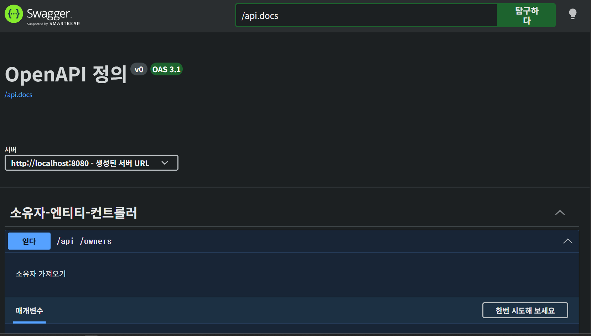
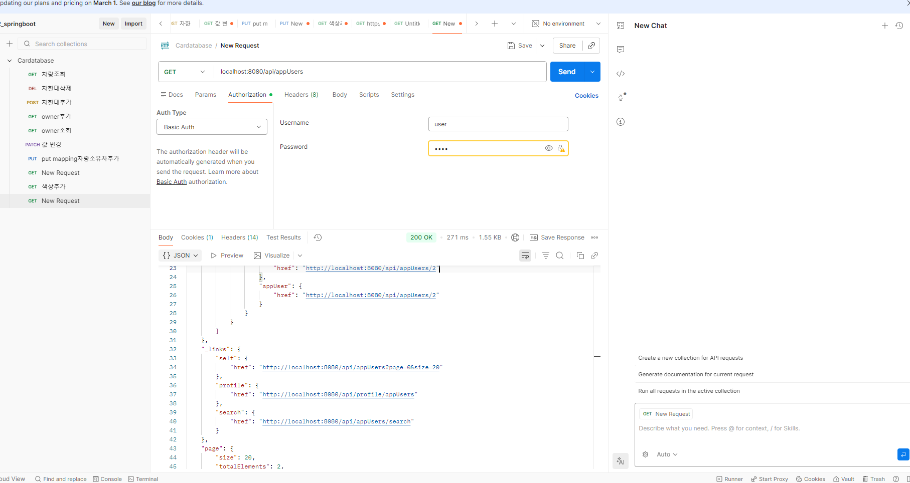
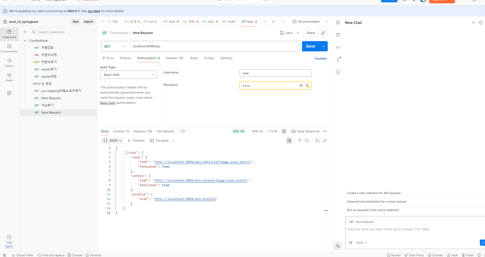

# Resttful api 명세서 작성

- Resttful api 를 이용하는 개발자가 그 기능과 작동을 이해할 수 있도록 적절히 문서화가 되어야한다. 
그리고 그 문서에는 이용할수있는 앤드포인트,허용되는 데이터형식, api와 상호작용하는 방법이포함되어야함

- 앤드포인트 자동생성떄문에 우리가파악하지못한 부분들이있을수 있어 api명세서는 중요하다.

# spring boot 의 swagger / open api
1. swagger / open api
- open api 
공개되어잇는 api사용법을 명세하는방식
Restful API 를 설계구축
- Swagger : api구조를 시각적으로 확인하고 직접테스트할수있도록돕는 툴

- 목적: 백 프론트간 협업시 별도의문서 작성없이 실시간으로 업데이트되는 api명세서를 제공

2. api (애플리케이션 프로그래밍 인터페이스)
_인터페이스 서로다른것끼리 서로 상호작용할수잇게하는모든것_ 

_서로 다른소프트웨어가대화할수 잇게해주는 규칙이나매개체_

비유) 손님: (client) - 주문하는사람 (앱or웹사이트)
      주방: (server) - db 요리하는곳 
      점원: (api)- 주문을 주방에전달 주방에서 만든 음식을 다시손님에게가져다줌

- 손님은 주방안에서 어떤 일이 일어나는지 알 필요가없다는 점, 점원에게 정해진규칙대로말하기만하면 원하는결과를얻음      

## api 핵심역할
1. 전달자 : 요청을 받고 응답 - req / resp로 작성함
2. 보안관문 : 아무데이터나 가져가지못하게 인증된 사용만 접근허용 (api key)
3. 표준화 : 서로 다른 언어로 만들어진 프로그램들이 같은 규칙으로 소통하게끔함.


- controller클래스가 api의 입구가된다. 즉 controller 클래스는 요청이왓을때 맨 처음처리하는 관문.

# 프로젝트설정
1. springboot 3.xx 버전에는 'jakatrta'로 써야함

```java
//오픈api
	implementation'org.springdoc:springdoc-openapi-starter-webmvc-ui:2.8.15'
```

-
-
2. application.properties

```java
# swagger
springdoc.swagger-ui.path=/swagger-ui.html
# open api doc path
springdoc.api-docs.path=/api.docs
# integrated 
springdoc.show-data-rest=true
```
http://localhost:8080/swagger-ui/index.html
3. api문서 상세설정


```JAVA
package korit_12.cardatabase00.config;


import io.swagger.v3.oas.models.OpenAPI;
import io.swagger.v3.oas.models.info.Info;
import org.springframework.context.annotation.Bean;
import org.springframework.context.annotation.Configuration;

@Configuration
public class OpenApiConfig {
    //BEAN? 
    @Bean
    public OpenAPI cardatabaseOpenAPI(){
            return new OpenAPI()
                    .info(new Info()
                            .title("Car Database API")
                            .description("자동차 소유쥬 관리를 위한 REST API 명세서 ")
                            .version("1.0.0")

                    );
    }//CALL3
}

```
메서드에 다는것임 BEAN

- '@Bean' : 메서드 레벨의 에너테이션으로 ,spring 컨테이너에 의해 관리되는 객체인 빈을 정의하고 등록하는 역할을한다.

@Bean정의
객체등록 : 해당 메서드가 반환하는 객체를 spring 의 
ioc컨테이너가 관리하는 빈으로등록.

***ioc*** 제어의역전

설정소스: 보통 '@configration'에너테이션이 붙은 클래스내에서 사용되며 이 클래스는 빈 정의를 제공하는 소스역할을 한다.

수동등록: 개발자가 직접 젝어할수 없는 외부 라이브러리객체를 생성하거나 복잡한 초기화 로직이생김 


```JAVA
package korit_12.cardatabase00.config;


import io.swagger.v3.oas.models.OpenAPI;
import io.swagger.v3.oas.models.info.Info;
import org.springframework.context.annotation.Bean;
import org.springframework.context.annotation.Configuration;

@Configuration // 빈 정의를 제공하는 소스클래스라는 것을 명시

public class OpenApiConfig {
    //BEAN? 
    @Bean //메서들 리턴객체를 spring빈으로 등록하는 에너테이션

    public OpenAPI cardatabaseOpenAPI(){
            //직접 openapi객체를 생성하고 커스터마이징한다.
            return new OpenAPI()
                    .info(new Info()
                            .title("Car Database API")
                            .description("자동차 소유쥬 관리를 위한 REST API 명세서 ")
                            .version("1.0.0")

                    );
    }//CALL3
}

```
- 실제 동작 관련 추가
  1. 설정 소스 인식 : springboot 애플리케이션이 실행될때 '@Configuration'에 붙은 클래스를 스캔하여
  빈 정의 소스로 인식
  2. 메서드 실행 및 등록 : 클래스 내부에서 '@Bean'이 붙은 cardatabaseAPI() 메소드를 spring이 직접호출
  3. 빈 관리:이상의 메서드에서 return 된 OpenAPI 객체는 Spring 컨테이너 내에서 보관. 해당 객체는 나중에 Swagger UI가 API 명세서를 생성할 때, 제목 / 설명 / 버전 등의 정보를 제공하는 설정 데이터(Config)로 사용됨.

  4. 유지보수성 향상:이처럼 @Bean을 통해 설정 정보를 분리, 관리하면 애플리케이션의 핵심 로직과 외부 설정 라이브러리 간의 결합도를 낮추고 유연하게 변경이 가능합니다.


  # IOC와 Bean
Spring 프레임워크 상에서 빈은 **스프링의 ioc컨테이너가 생성하고 관리하는 자바 객체를**의미

단순히 "new" 키워드를 이용하여 직접 생성하는 일반적인 java 객체와는 달리 빈은 스프링컨테이너에 의해 생명주기(생성, 초기화,소멸)가 관리된다.

1. 빈의 핵심역할: 의존성 주입
- 빈은 'ApplicationContext'라는 컨테이너를 통해 빈을 관리하며 객체 간의 의존성을 자동으로 연결해준다.
(field, setter, 생성자)

- 코드간의 결합도를 낮추고 유연성을 높일수있다.

- CardatabaseApplication 클래스에서 직접 CarRepository객체를 생성하지않고 필드선언을 통해서 스프링이 관리하는 빈을 주입받아 사용햇다.

  - CarRepository carRepository, OwnerRepository ownerRepository(); 를 저희가 호출한 적이 없다는 점에서 spring컨테이너에서 알아서 객체 생성해서 필드주입을 했다.


 2. 빈 등록 방법
  - '@Bean' 을 수동으로 등록하는 방법 중 하나이고 위의 예시를 생각했을 때는 컴포넌트 스캔을 통해서 자주이루어진다.
  - 컴포넌트 스캔이란 특정 에너테이션이 붙은 클래스를 자동으로 검색하여 빈으로 등록하는 것.,
  - OwnerRepository에 에너테이션이없는데? 
  extend JpaRepository가 있으므로가능
  @Componet : 일반적인 컴포넌트 빈
  @Service:비지니스 로직을 처리하는 서비스 클래스
  @RePository:데이터베이스 접근을 담당하는 리포지토리 클래스
  @Contoroller/@RestController :  웹 요청을 처리하는 컨트롤러 클래스
- 설정 클래스에서 수동 등록 : @Configuration 내부에서 @Bean이 있으면 수동 등록이 됩니다.

3. 빈의 특징
- 관리 주체:개발자가 아니라 스프링 컨테이너가 객체를 관리합니다.
- 싱글톤 원칙: 기본적으로 스프링은 빈을 단 하나만 생성하여 애플리케이션 전체에서 공유하여 재사용할 수 있도록 합니다(메모리 효율성)
- 명명규칙:빈은 고유한 이름을 가지며, 스프링은 이 이름을 통해 필요한 곳에 적절한 빈을 찾아 주입합니다.

# 백앤드 보호

cardatabase만들기 

1. spring security이해
2. JWT로 백앤드보호
3. 역할기반보안

# 스프링 시큐리티
- JAVA 기반 웹 애플리케이션 보호를 위한 서비스 제공 라이브러리

- default 설정 값
1. 인메모리 사용자 하나를 포함하는 'AuthenticationManager' 빈.usename은 user,암호는 console에 출력
2. '/css' , '/images'

3. 스프링 자체에서 인터페이스로보호되는 보호이벤트

4. HSTS, XSS, CSRF 등 일반적인 재수준 기능을 기본적으로 활성화
5. 자동생성 로그인 페이지


- 의존성추가


build.gralde에
spring security를 도입했기 때문에 생겨난창

http://localhost:8080/login 으로 접속했을때 혹은 
/api까지 해서 접속했을 때 알아서 /login 앤드포인트로
넘어가면서 로그인할것

- 재실행해보면 비밀번호는 매번 바뀌어잇고 또 찾아서 로그인해야한다.
username/password 를 고정시키고 싶다면 스프링시큐어리티를 
config클래스를 정의해야한다. 해당클래스내에서 

```java
package korit_12.cardatabase00.config;


import org.springframework.context.annotation.Bean;
import org.springframework.context.annotation.Configuration;
import org.springframework.security.config.annotation.web.configuration.EnableWebSecurity;
import org.springframework.security.core.userdetails.User;
import org.springframework.security.core.userdetails.UserDetails;
import org.springframework.security.crypto.bcrypt.BCryptPasswordEncoder;
import org.springframework.security.crypto.password.PasswordEncoder;
import org.springframework.security.provisioning.InMemoryUserDetailsManager;

@Configuration
@EnableWebSecurity
public class SecurityConfig  {
    @Bean
    public InMemoryUserDetailsManager userDetailsService(){
        UserDetails user = User.builder()
                .username("user")
                .password(passwordEncoder().encode("password"))
                .roles("USER")
                .build();

        return new InMemoryUserDetailsManager(user);
    }

    @Bean
    public PasswordEncoder passwordEncoder(){
        return new BCryptPasswordEncoder();
    }

}


```

- @Configration , @EnableWebSecurity 에너테이션은
default 웹 보호 구성을 해제 , 개발자가 직접
config 관련 설정을 정의할수 있도록 허용한다. 

'filterChain(HttpSecurity htpp)' 메서드 내에서 애플리케이션의 어떤 앤드포인트가 보호되고 있는지 
어떤 앤드포인트가 보호되고 있지않은지 정의.

-userdetailsService 를 구현하는 스프링 시큐리티의 
inMemoryUserDetailsService를 이용하여
애플리케이션에 인메모리 user를 추가했다. 
메모리에 저장된 user/password인증을 구현했다.

빌더패턴이용

- H2에서 확인했듯이 인메모리 사용자는 DB에 
저장된것이 아니기때문에 껏다켜면 초기화가이루어진다.

USER 관련속성을 DB에 저장하고싶다면 CAR/ OWNER와
마찬가지로 엔티티 클래스와 리포지토리클래스를정의

- 

- findByUsername 메서드정의


```java
package korit_12.cardatabase00.repository;

import korit_12.cardatabase00.entity.AppUser;
import org.springframework.data.jpa.repository.JpaRepository;

import java.util.Optional;

public interface AppUserRepository extends JpaRepository<AppUser, Long> {

    Optional<AppUser> findByUsername(String username);

    
    
}
```
- optional 

- CarRepository에 추상메서드들을 정의했을 때 결과값들이 기본적으로 복수로 나오기때문에 List자료형을 썼다. 하지만  findByUsername()메서드의 경우 
AppUser의 필드인 username이 기본적으로 '@Column(nullable=false, unique=true)'라는 설정 떄문에 결과값이 하나, 아니면 0개

그렇다면 return타입을 list로 설정하는 것은 적절하지않다.

```java
public AppUser findByUsername(String username){
if( username이 DB내에서 일치하는 username이 있다면)
{ return 일치하는 객체전체를 return(AppUser자료형)

}
  return null;
}

```
과 같은 방식으로 미리 예외처리를 해줘야했음. 
근데 AppUserRepository는 인터페이스니까 일반메서드를 만들수있다. 

즉,findByUsername()이 필요할떄마다 이런로직이필요함.
이를해결하는 자료형이 'Optional'입니다.

코드한줄추가로 예외발생을막음!

- 이건 처음배우는 자료형에 해당한다. Optional내부에는 null 이 존재할수있다. 그 상황에서 예외발생x 
Optional 내부에 AppUser자료형이 존재한다면 객체를꺼내는 별개의 메서드를 호출할 필요는있다.


- 


```java
package korit_12.cardatabase00.service;

import korit_12.cardatabase00.entity.AppUser;
import korit_12.cardatabase00.repository.AppUserRepository;
import lombok.AllArgsConstructor;
import org.springframework.security.core.userdetails.User;
import org.springframework.security.core.userdetails.User.UserBuilder;
import org.springframework.security.core.userdetails.UserDetails;
import org.springframework.security.core.userdetails.UserDetailsService;
import org.springframework.security.core.userdetails.UsernameNotFoundException;
import org.springframework.stereotype.Service;

import java.util.Optional;

//특정한인터페이스를 구현한 규칙 UserDetailsServiceImpl


@Service
@AllArgsConstructor
public class UserDetailsServiceImpl implements UserDetailsService {
    //필드선언
    private AppUserRepository appUserRepository;
    @Override
    public UserDetails loadUserByUsername(String username) throws UsernameNotFoundException {
        Optional<AppUser> user= appUserRepository.findByUsername(username);
        UserBuilder builder=null;
        //내부에널이아닌 무언가가존재한다면
        if (user.isPresent()) { //if가 실행되면 user를 AppUser 객체가 있다.
            AppUser currentUser = user.get(); //Optional 에서 제네릭으로 존재하는 객체를 빼내는메서드 get()
            builder = User.withUsername(username)
                    .password(currentUser.getPassword())
                    .roles(currentUser.getRole());
        }else {
            throw new UsernameNotFoundException("해당 username을 가진 사용자를 찾지 못함");

        }
        return builder.build();

    }
}
```
- 클래스명을 보면 
UserDetailsServiceImpl이라고되어있는데 , 이는 대표적인
인터페이스를 구현한 클래스를 나타내는 클래스 명명법으로 '인터페이스명+Impl'을 기준으로 작성한다
즉 UserDetailsService라는 인터페이스의 추상메서드를 구현한 클래스라서 UserDetailsServiceImpl이 되는것이다.
최초 명명법 발생시에는 가독성을 높이기위한 클래스이름짓기 방식이었다고봐야함.

- loadUserByUsername() 메서드 내부에서 AppUser클래스의
인스턴스인  user(객체명) 를 그대로 쓰는것이아닌 어디서 userBuilder라고 선언하고 거기내부에 AppUser의 field의 값들을 하나씩 대입한 다음 return했다는것.
이는 인터페이스의 정의를 명확하게 알지못하면 효율적이지 못한 코드로 해석될 여지가 있다. 인터페이스는 추상 메서드만 존재한다. 그리고 이를 구현
하는 클래스는 인터페이스 내에있는 추상메소드들을 강제로 구현해야함. 
우리가 AppUser라고하는 앤티티클래스를 만들기 이전에 인터페이스가 존재했고 이를 구현했으므로 추상메서드들의 return type 은 AppUser가 될수 없다. 또한 다른 개발자들도 이 인터페이스를 가져쓸것이기때문에 자료형에 대한 보면적인 폼이존재한다...

추상메서드인 loadUserByUsername()의 return타입이 고정되어있으므로 우리는 우리가 만든 entity class
의 객체를 User Details 클래스의 객체형태로 대입해주는 과정을 거쳐야함.  
if문 내부의 실행문에서 대입로직이 존재한다. 
else는 일치하는 AppUser가 없다는것으로 예외처리를함

- 스프링시큐어리티가 인메모리 사용자 대신에 방금 만든 AppUser 관련 데이터베이스의 사용자를 참조하게끔 코드 수정

```java
package korit_12.cardatabase00.config;


import org.springframework.context.annotation.Bean;
import org.springframework.context.annotation.Configuration;
import org.springframework.security.config.annotation.web.configuration.EnableWebSecurity;
import org.springframework.security.core.userdetails.User;
import org.springframework.security.core.userdetails.UserDetails;
import org.springframework.security.crypto.bcrypt.BCryptPasswordEncoder;
import org.springframework.security.crypto.password.PasswordEncoder;
import org.springframework.security.provisioning.InMemoryUserDetailsManager;

@Configuration
@EnableWebSecurity
public class SecurityConfig  {
    @Bean
    public InMemoryUserDetailsManager userDetailsService(){
        UserDetails user = User.builder()
                .username("user")
                .password(passwordEncoder().encode("password"))
                .roles("USER")
                .build();

        return new InMemoryUserDetailsManager(user);
    }

    @Bean
    public PasswordEncoder passwordEncoder(){
        return new BCryptPasswordEncoder();
    }

}


```java

package korit_12.cardatabase00.config;


import korit_12.cardatabase00.service.UserDetailsServiceImpl;
import lombok.AllArgsConstructor;
import lombok.RequiredArgsConstructor;
import org.springframework.context.annotation.Bean;
import org.springframework.context.annotation.Configuration;
import org.springframework.security.config.annotation.authentication.builders.AuthenticationManagerBuilder;
import org.springframework.security.config.annotation.web.configuration.EnableWebSecurity;
import org.springframework.security.core.userdetails.User;
import org.springframework.security.core.userdetails.UserDetails;
import org.springframework.security.crypto.bcrypt.BCryptPasswordEncoder;
import org.springframework.security.crypto.password.PasswordEncoder;
import org.springframework.security.provisioning.InMemoryUserDetailsManager;

@Configuration
@EnableWebSecurity
@AllArgsConstructor
public class SecurityConfig  {
    private UserDetailsServiceImpl userDetailsService;

    public void configureGlobal(AuthenticationManagerBuilder auth)throws Exception{
        //auth.메서드명.필드명
        auth.userDetailsService(userDetailsService);
        
    }
    @Bean
    public PasswordEncoder passwordEncoder(){
        return new BCryptPasswordEncoder();
    }

}
```
BCryptPasswordEncoder()
- bcrypt는 해싱함수로써 예로
'$2a$12$HxwKwzXryqZBuQkS7TSPxOkkdU4vOfW.a8P110OlaY0x8DRIPgltS'
는 admin문자열에서 생성되는 bycript의 예시

'$2a'는 알고리즘 버전을 의미하고 '$12'는 알고리즘 강도를 나타낸다.. 그리고 SpringSecurity상에서 BCryptPasswordEncoder의 기본강도는 10임



postman에서 이렇게 get하면 이런결과값이나오는데
자기가 로그인만 되어있으면 다른사람들 비밀번호 해싱함수버전을 얻을수있다는것을 의미합니다.

그래서 AppUserRepository 를 통해 요청을 날리지 못하도록 설계한다. Spring Data REST 때문에 자동으로 
AppUser 관련 앤드포인트가생성되는것임,.





//20260224 today class study ...


토트넘 리그or챔스우승
우리나라 월드컵우승
우리나라 통일


